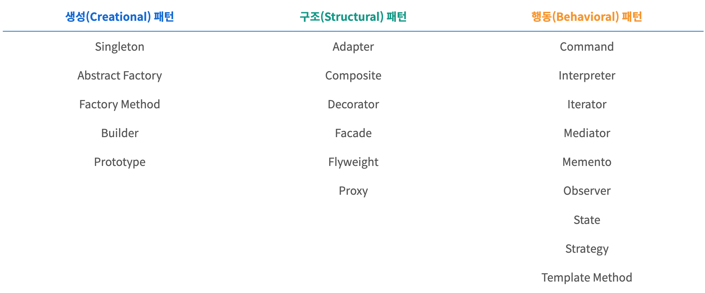

## 싱글톤 패턴

### 디자인 패턴

소프트웨어 엔지니어링에서 디자인 패턴은 코드 작성 방법과 관련하여 컴퓨터 프로그램의 잘 정의된 측면(예: 기능성)을 설명합니다.

패턴을 사용하면, 재발명하기보다 기존의 컨셉을 활용할 수 있습니다. 이는 소프트웨어 개발 효율을 높입니다.

개념적으로는, 디자인 패턴은 프로그래밍 패러다임보다는 구체적이지만, 알고리즘보다는 추상적인 개념입니다.



### 싱글톤 패턴이란?

> **한 클래스에서 한 인스턴스만** 생성할 수 있도록 하는 생성 패턴입니다.

한 클래스에서 단 하나의 인스턴스를 만들어 이를 기반으로 로직을 만드는 데 쓰입니다.

하나의 인스턴스를 다른 모듈들이 공유하며 사용하기 때문에 인스턴스를 생성할 때 발생하는 비용이 줄어드는 장범이 있습니다. 하지만 의존성이 높아진다는 단점이 있습니다.

### Javascript에서

```javascript
class Singleton {
    constructor() {
        if (!Singleton.instance) {
            Singleton.instance = this;
        }
        return Singleton.instance;
    }

    getInstance() {
        return this;
    }
}

const a = new Singleton();
const b = new Singleton();
console.log(a === b); // true
```

### Database 연결 모듈

```javascript
const URL = 'mongodb://localhost:27017/kundolapp'
const createConnection = url = ({"url" : url}) // 커넥션 예시 객체
class DB{
    constructor (url) {
        if(!DB.instance) {
            DB.instance = createConnection(url)
        }
        return DB.instance
    }
    connect() {
        return this.instance
    }
}
const a= new DB(URL)
const b = new DB(URL)
console. log(a = = b) // true
```

### Java에서

```java
class Singleton {
    private static class singleInstanceHolder {
        private static final Singleton INSTANCE = new Singleton();
    }
    public static Singleton getInstance(){
        return singleInstancellolder.INSTANCE;
    }
}

public class Helloworld {
    public static void main(String[] args) {
        Singleton a = Singleton.getInstance();
        Singleton b = Singleton.getInstance();
        System.out.println(a.hashCode());
        System.out.println(b.hashCode());
        if (a == b) {
            System.out.println(true);
        }
    }
}
```

### mongoose

https://github.com/Automattic/mongoose/blob/master/lib/mongoose.js#L437

```javascript
Mongoose.prototype.connect = async function connect(uri, options) {
    if (
        typeof options === "function" ||
        (arguments.length >= 3 && typeof arguments[2] === "function")
    ) {
        throw new MongooseError(
            "Mongoose.prototype.connect() no longer accepts a callback"
        );
    } // 더이상 콜백을 지원하지 않음

    const _mongoose = this instanceof Mongoose ? this : mongoose; // 싱글톤 인스턴스 가져오기
    if (_mongoose.connection == null) {
        _createDefaultConnection(_mongoose);
    }
    const conn = _mongoose.connection;

    return conn.openUri(uri, options).then(() => _mongoose);
};
```

### MySQL

```javascript
const mysql = require("mysql");
const pool = mysql.createPool({
    connectionLimit: 10,
    host: "example.org",
    user: "ssafy",
    password: "ssafy",
    database: "ssafy",
});
pool.connect();

// 모듈 A.js에서
pool.query(query, function (err, res, fields) {
    if (err) throw err;
    console.log("The solution is: ", res[0].solution);
});

// 모듈 B.js에서
pool.query(query, function (err, res, fields) {
    if (err) throw err;
    console.log("The solution is: ", res[0].solution);
});
```

같은 pool 객체를 가져와서 query를 사용한다.

### 단점

테스트 마다 독립적인 인스턴스를 가져오기 힘들기 때문에, TDD(테스트 주도 개발)의 걸림돌이 되곤 합니다.

### 의존성 주입(DI, Dependency Injection)

햄버거 요리사가 어떤 버거를 만들지 직접 결정하지 않고,
가게 주인이 결정해서 요리사에게 주입하는 방법.

https://tecoble.techcourse.co.kr/post/2021-04-27-dependency-injection/

의존성 주입은 결국 추상화를 통한 디커플링 과정!  
\+ 더 나아가 객체의 생성을 외부로 위임함으로써 코드의 유연성과 테스트 용이성을 높이는 설계 패턴이다.
