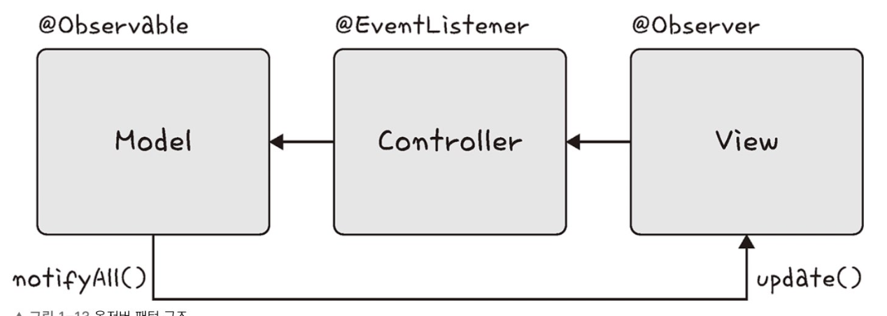

## 옵저버 패턴

> 객체의 상태변화를 관찰하고, 변화가 있을 때마다 `옵저버`들에게 변화를 알려주는 패턴.

-   객체 : 상태변화가 일어나는 곳
-   주체 : 객체를 바라보고 있는 관찰자

한 객체가 두 가지 역할 모두 할 수 있습니다. (주체이자 객체)

### MVC 패턴

MVC 패턴은 소프트웨어 디자인 패턴 중 하나로, 애플리케이션을 세 가지 주요 구성 요소로 분리합니다:

Model: 애플리케이션의 데이터와 비즈니스 로직을 담당합니다.
View: 사용자 인터페이스 요소를 담당하며, 데이터를 사용자에게 보여줍니다.
Controller: 사용자 입력을 처리하고, Model과 View를 연결하는 역할을 합니다.


MVC 패턴에서 observer 패턴이 사용됩니다.

이 구조에서 Model이 주체(Subject)가 되고 View가 옵저버(Observer)가 됩니다. Model은 자신의 상태가 변경될 때 등록된 View에게 알림을 보내고, View는 이 알림을 받아서 자신을 갱신합니다.

### Javascript에서

### 프록시 객체

[Proxy-MDN](https://developer.mozilla.org/en-US/docs/Web/JavaScript/Reference/Global_Objects/Proxy)

어떠한 대상의 기본적인 동작(속성 접근, 할당, 순회, 열거, 함수 호출 등)의 작업을 가로챌 수 있는 객체

-   target: 프록시할 대상
-   handler: target 동작을 가로채어 수행할 동작

```javascript
const handler = {
    get: function (target, name) {
        return name === "name" ? `${target.a} ${target.b}` : target[name];
    },
};
const p = new Proxy({ a: "junghyeok", b: "is FE developer" }, handler);
console.log(p.name);

// junghyeok is FE developer
// name을 가져올 때, handler의 get 메소드가 실행되어 target.a + target.b를 반환한다.
```

### Vue.js

React나 Vue.js에서 실시간 부분 랜더링을 지원하는 것을 익히 들었을 것입니다. 이는 프록시 객체를 사용해 옵저버 패턴이 구현된 기능입니다.

https://github.com/vuejs/core/blob/main/packages/reactivity/src/reactive.ts#L251

```javascript
function createReactiveObject(
    target: Target,
    isReadonly: boolean,
    baseHandlers: ProxyHandler<any>,
    collectionHandlers: ProxyHandler<any>,
    proxyMap: WeakMap<Target, any>
) {
    if (!isObject(target)) {
        if (__DEV__) {
            warn(
                `value cannot be made ${
                    isReadonly ? "readonly" : "reactive"
                }: ${String(target)}`
            );
        }
        return target;
    }
    // target is already a Proxy, return it.
    // exception: calling readonly() on a reactive object
    if (
        target[ReactiveFlags.RAW] &&
        !(isReadonly && target[ReactiveFlags.IS_REACTIVE])
    ) {
        return target;
    }
    // target already has corresponding Proxy
    const existingProxy = proxyMap.get(target);
    if (existingProxy) {
        return existingProxy;
    }
    // only specific value types can be observed.
    const targetType = getTargetType(target);
    if (targetType === TargetType.INVALID) {
        return target;
    }
    const proxy = new Proxy(
        target,
        targetType === TargetType.COLLECTION ? collectionHandlers : baseHandlers
    ); // 이 부분! 실제로 프록시 객체를 생성한다.
    proxyMap.set(target, proxy); // 프록시 객체 맵에 추가
    return proxy;
}
```

-   옵저버 패턴이 무엇인지, 대표적인 예를 들어 설명해보세요.
